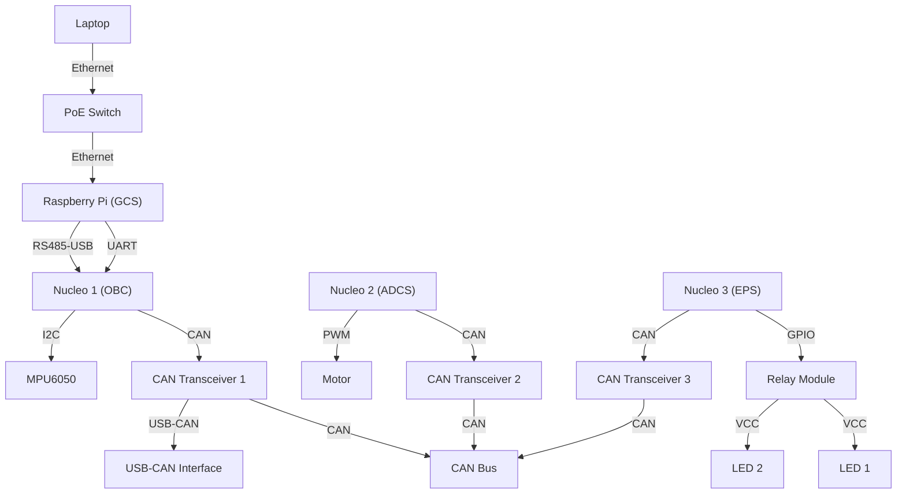

# Flatsat Testbed

## Purpose

This project explores the interface layer of three satellite subsystems: the primary onboard compute system (OBC), the attitude determination and control system (ADCS), and the electronic power system (EPS).

## System Architecture

## Bill of Materials

Part | Amount | Vendor
-----|--------|-------
STMicroelectronics NUCLEO-F767ZI development board | 3x | Amazon
TJA1050 CAN Bus transceiver | 3x | Amazon
AOICRIE MPU-6050 3-axis IMU | 2x | Amazon
SUZLAZYR 2804 DC brushless motor | 1x | Amazon
BEMONOC 25GA370 150RPM DC geared motor | 1x | Amazon
Reland Sun L298N motor drive controller board | 1x | Amazon
SunFounder 4-channel 5V relay shield | 1x | Amazon
ATECC608 AES-128 encryption authentication chip | 1x | Amazon
NETGEAR 5-port managed Ethernet switch | 1x | Amazon