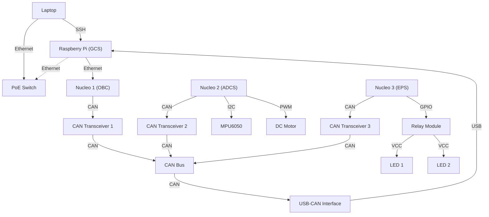

# Flatsat Testbed

## Purpose

This project implements a distributed satellite subsystem architecture using three STM32 microcontrollers coordinating over CAN bus and supervised by a Raspberry Pi ground control station (GCS):

- **Onboard computer (OBC)** - Distributes local CAN traffic between nodes and forwards IMU telemetry to the GCS

- **Attitude determination and control system (ADCS)** - Runs an open feedback loop to actuate a geared DC motor in response to motor commands sent from the GCS

- **Electronic power system (EPS)** - Cycles through LED relays wired in series and in parallel to demonstrate power distribution with fault tolerance using normally open (NO) and normally closed (NC) circuits

## System Architecture


```mermaid
graph TD
    Laptop -->|Ethernet| PoE[PoE Switch]
    RPi["Raspberry Pi (GCS)"] -.-> |Ethernet| PoE

    Laptop -->|SSH| RPi

    RPi -->|Ethernet| OBC["Nucleo 1 (OBC)"]
    OBC -->|CAN| CT1[CAN Transceiver 1]

    ADCS["Nucleo 2 (ADCS)"] -->|CAN| CT2[CAN Transceiver 2]
    ADCS -->|I2C| MPU[MPU6050]
    ADCS -->|PWM| Motor[DC Motor]

    EPS -->|CAN| CT3[CAN Transceiver 3]
    EPS["Nucleo 3 (EPS)"] -->|GPIO| Relay[Relay Module]
    
    Relay -->|VCC| LED1[LED 1]
    Relay -->|VCC| LED2[LED 2]

    CT1 -->|CAN| Bus[CAN Bus]
    CT2 -->|CAN| Bus
    CT3 -->|CAN| Bus

    Bus -->|CAN| ExtCAN[USB-CAN Interface] -->|USB| RPi
```

## Usage

#### Initial configuration

```bash
git submodule update --init
```

#### Build the subsystem firmware

```bash
make obc
make adcs
make eps
```

#### Flash the MCUs

```
make flash_obc
make flash_adcs
make flash_eps
```

## Bill of Materials

Part | Amount | Vendor
-----|--------|-------
STMicroelectronics NUCLEO-F767ZI development board | 3x | Amazon
TJA1050 CAN Bus transceiver | 3x | Amazon
AOICRIE MPU-6050 3-axis IMU | 2x | Amazon
SUZLAZYR 2804 DC brushless motor | 1x | Amazon
BEMONOC 25GA370 150RPM DC geared motor | 1x | Amazon
Reland Sun L298N motor drive controller board | 1x | Amazon
SunFounder 4-channel 5V relay shield | 1x | Amazon
ATECC608 AES-128 encryption authentication chip | 1x | Amazon
NETGEAR 5-port managed Ethernet switch | 1x | Amazon